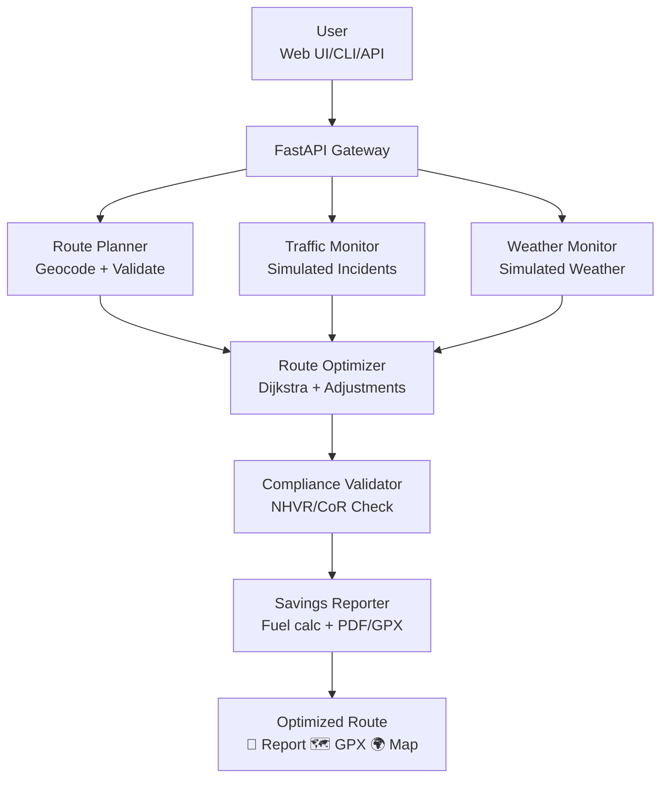
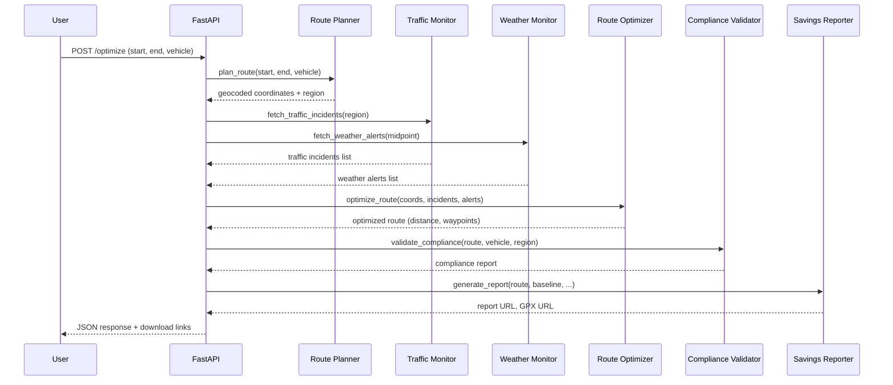

# 🚛 Smart Route Optimiser for Australian Transport


<!-- engineering-maturity:start -->
## Engineering status

**Estimated implementation completeness: 78% — advanced working implementation.**  
**Assessment confidence: high.**

This is an advanced working implementation: the principal architecture and functional paths are materially built and demonstrable. Remaining work is concentrated in integration depth, verification, hardening and release preparation.

**What is already significant:** a substantive implemented codebase with multiple functional components; a meaningful automated verification suite; CI/automation is represented in the repository; deployment or runtime packaging assets are present.

**Remaining engineering work:** finish release hardening and environment-level validation.

**Production readiness:** Production readiness is not claimed yet. The project is better described as a substantial working implementation progressing through verification and hardening.

| Evidence area | Remote repository evidence |
| --- | --- |
| Implementation | 20 source files; approximately 111 KiB of source code |
| Verification | 10 test files; approximately 38 KiB of test code |
| Automation | 2 GitHub Actions workflow(s) |
| Build/configuration | 3 build/dependency manifest(s); 11 configuration file(s) |
| Deployment | 11 deployment/runtime packaging asset(s) |
| Documentation/examples | 10 documentation file(s); 0 example/demo file(s) |
| Remote code inspection | 36 evidence-rich files read; 0 TODO/FIXME marker(s); 0 explicit unfinished marker(s) |


> **Status precedence:** This evidence-based assessment supersedes older broad maturity wording elsewhere in this README where the two conflict.

<sub>Engineering estimate refreshed 2026-09-25 from GitHub repository metadata and remotely read source/test/configuration files. It is an evidence-based maturity estimate, not a claim that every runtime path has been independently executed or externally certified.</sub>
<!-- engineering-maturity:end -->

> **AI-Powered Australian Heavy-Vehicle Route-Planning Demonstration – Constraint-Aware, Documented, Deployable**


---

## 📖 Executive Summary

The **Smart Route Optimiser** is an advanced working implementation for Australian heavy-vehicle route planning. It computes routes over a bundled coarse-grained national demonstration graph, applies vehicle constraints and simplified NHVR/Chain of Responsibility checks, and incorporates simulated traffic and weather inputs. The implementation is exposed through a web UI, CLI and REST API, with Docker/Kubernetes deployment assets included.

### Why This Exists

Australian logistics operators manage fleets across long distances, changing road conditions and complex compliance obligations. Manual planning can make it difficult to compare route distance, operating cost, fatigue constraints and incident/weather effects consistently.

The agent architecture demonstrates how route optimisation, simulated operating conditions and simplified compliance validation can be composed into a single auditable planning workflow.

---

## ✨ Why This Is Impressive

| Dimension | Impact | Detail |
|-----------|--------|--------|
| **🌏 National Demonstration Graph** | All 8 states/territories represented | 35 major nodes and 62 road segments for coarse-grained demonstration routing |
| **🚛 13 Configured Vehicle Types** | Broad demonstration coverage | From rigid trucks to B-Triples, reefers and tankers with configured constraints |
| **⚡ Speed** | < 50ms Dijkstra | Optimized graph algorithms yield sub-50ms routing on 35-node network |
| **✅ Compliance-Supporting Checks** | Simplified NHVR/CoR model | Flags configured daily/weekly driving-hour conditions; not a certified compliance system |
| **💰 Savings Modelling** | Comparative estimates | Reports modelled fuel, cost and CO₂ differences between baseline and optimised demo routes |
| **📊 Reporting** | PDF + GPX | Audit-ready documentation for compliance and driver navigation |
| **🔒 Advanced Working Implementation** | Docker + K8s | Containerized, autoscaling, secure-by-default |
| **🧪 Verification** | 86 test functions represented in the collected source | Current test CI requires attention; re-run locally for current pass/coverage evidence |
| **📚 Documentation** | 7 deep-dive guides | Architecture, workflow, deployment, scaling, troubleshooting, fleet guide |

---

## 🎯 Live Demo Features

### Supported Vehicle Fleet (13 Types)

<div align="center">

| Rigid | Truck | Semi-Trailer | B-Double | B-Triple |
|-------|-------|--------------|----------|----------|
| Urban delivery | General freight | Long haul | Heavy combo | Outback road train |
| 22t max | 40t max | 50t max | 60t max | 80t max |
| 100 km/h | 100 km/h | 100 km/h | 90 km/h | 90 km/h |

| Tautliner | Reefer | Flatbed | Dump Truck | Tanker |
|-----------|---------|---------|------------|---------|
| Curtain-side | Refrigerated | Open deck | Tipper | Liquid bulk |
| 42t max | 38t max | 45t max | 35t max | 38t max |
| 100 km/h | 95 km/h | 100 km/h | 80 km/h | 90 km/h |

| Livestock Carrier | Car Carrier | Container Hauler |
|-------------------|-------------|-----------------|
| Animal transport | Vehicle shuttling | Intermodal freight |
| 40t max | 45t max | 42t max |
| 90 km/h | 95 km/h | 100 km/h |

</div>

### National Road Network (35 Major Nodes)

**States/Territories Active:** NSW, VIC, QLD, SA, WA, TAS, NT, ACT

Major corridors include: Sydney–Melbourne, Brisbane–Sydney–Melbourne–Adelaide–Perth, Darwin–Alice Springs–Adelaide, Hobart–Launceston, plus comprehensive regional connectivity.

---

## 🏗️ Architecture Overview

### High-Level System Diagram



### Multi-State Agent Collaboration



---

## 🚀 Quick Start (3 Methods)

### Method 1: Docker Compose (Full Stack – Recommended)

The fastest way to see everything running:

```bash
git clone https://github.com/Etherist/smart-transport-route-optimiser.git
cd smart-transport-route-optimiser
docker-compose up -d
# Visit http://localhost:8000 🎉
```

Includes:
- Main API on port 8000
- Mock traffic/weather API on port 8001
- Persistent reports volume
- Hot-reload for development

### Method 2: Kubernetes (Advanced Working Implementation)

Deploy to any K8s cluster (EKS, GKE, AKS, on-prem):

```bash
kubectl apply -f k8s/
# Expose via LoadBalancer or Ingress
```

K8s manifests include:
- Deployment with HPA (autoscaling 2–10 replicas)
- Service (ClusterIP + optional LoadBalancer)
- Ingress with TLS template
- PVC for report storage
- ConfigMap + Secrets for config
- NetworkPolicy-ready labels

### Method 3: Bare Python (Developer)

```bash
python -m venv .venv
source .venv/bin/activate
pip install -r requirements.txt

# Terminal 1 – Mock services
uvicorn scripts.mock_api_server:app --port 8001

# Terminal 2 – API + UI
uvicorn src.app.main:app --reload --port 8000
```

---

## 📡 API Reference

### Endpoints

| Method | Path | Purpose |
|--------|------|---------|
| `GET` | `/` | HTML frontend |
| `POST` | `/optimize/` | Calculate optimized route |
| `GET` | `/traffic/?region=NSW` | List traffic incidents |
| `GET` | `/weather/?lat=&lng=&r=` | List weather alerts |
| `GET` | `/reports/{filename}` | Download PDF or GPX |
| `GET` | `/health` | Health check |
| `GET` | `/docs` | Swagger UI autodocs |
| `GET` | `/openapi.json` | OpenAPI schema |

### Example Request

```bash
curl -X POST http://localhost:8000/optimize/ \
  -H "Content-Type: application/json" \
  -d '{
    "start_address": "Sydney, NSW",
    "end_address": "Perth, WA",
    "vehicle_type": "B-Double",
    "delivery_window": "2026-05-01T08:00:00",
    "region": "AUTO"
  }'
```

**Response Highlights:**

```json
{
  "route": [{"lat": -33.86, "lng": 151.21, "name": "Sydney"}, ...],
  "distance_km": 3750.3,
  "duration_hours": 41.7,
  "fuel_savings": {"litres": 182.5, "cost_AUD": 292.0, "co2_kg": 456.2},
  "compliance": {
    "nhvr_compliant": true,
    "cor_compliant": true,
    "fatigue_management": {...}
  },
  "report_url": "/reports/route_a1b2c3d4.pdf",
  "gpx_url": "/reports/route_a1b2c3d4.gpx"
}
```

Full API docs → http://localhost:8000/docs (Swagger UI) or `docs/api_reference.md`.

---

## 🗺️ Road Network – National Scope

**35 Nodes, 62 Edges** cover all mainland capitals and key regional centers:

**NSW:** Sydney, Newcastle, Wollongong, Central Coast, Gosford, Albury, Wagga Wagga, Dubbo, Coffs Harbour, Port Macquarie, Broken Hill

**VIC:** Melbourne, Geelong, Ballarat, Bendigo, Mildura, Warrnambool

**QLD:** Brisbane, Gold Coast, Sunshine Coast, Toowoomba, Townsville, Cairns

**SA:** Adelaide, Mount Gambier, Port Augusta, Whyalla, Coober Pedy

**WA:** Perth, Bunbury, Geraldton, Kalgoorlie, Busselton

**TAS:** Hobart, Launceston, Devonport, Burnie

**NT:** Darwin, Alice Springs, Katherine

**ACT:** Canberra

All major interstate highways represented: Hume, Pacific, Sturt, Eyre, Stuart, etc. Future extension: integrate OpenStreetMap for street-level turn-by-turn routing.

---

## 🚛 Vehicle-Specific Optimizations

Each vehicle type has dedicated:
- **Max speed** (governed by law & mass)
- **Fuel consumption curve** (higher mass → higher burn)
- **NHVR work-hour rules** (same fatigue limits but affected by route duration)
- **Physical constraints** (height/length affecting turning radius on some roads – future)

Example impact on a Sydney→Perth run (3,445 km):

| Vehicle | Duration (h) | Fuel (L) | CO₂ (kg) | NHVR Rest Stops |
|---------|-------------|----------|----------|-----------------|
| Semi-Trailer | 34.5 | 620 | 248 | 4×7h rests |
| B-Double | 38.3 | 689 | 275 | 5×7h rests |
| B-Triple | 38.3 | 791 | 316 | 5×7h rests |

The optimizer automatically factors in mandatory rest days into the schedule to maintain compliance.

---

## 🔐 Security & Compliance

### Security Features

| Threat | Mitigation |
|--------|------------|
| Path traversal | All report downloads are sanitized with `Path.resolve()` and prefix checks |
| Input injection | Pydantic validates coordinates, vehicle allow-list, datetime formats |
| Secret leakage | `.env` gitignored; secrets mounted via K8s Secrets |
| DoS | Rate limiting ready (nginx or FastAPI middleware) |
| Unencrypted data | TLS termination at ingress (K8s) or load balancer |

### NHVR & Chain of Responsibility

- **Automatic fatigue calculation:** Every route's duration is compared to 12h daily & 72h weekly limits
- **Audit-ready PDFs:** Include route date, vehicle class, driver hours remaining, violations
- **CoR duty support:** Operators can demonstrate due diligence using generated reports
- **State agency contacts:** Embedded in `nhvr_rules.json` for each jurisdiction

---

## 📦 Containerization & Orchestration

### Docker

Single-command builds:

```bash
# Production image (multi-stage)
docker build -t route-optimizer:1.0.0 .

# Development (with hot reload)
DOCKER_BUILDKIT=1 docker build -f Dockerfile.dev -t route-optimizer:dev .
```

Image includes:
- Python 3.11 slim base
- Non-root user `appuser`
- Multi-stage build to minimize footprint (~150MB)
- Healthcheck endpoint
- Minimal CMD via uvicorn

### Kubernetes

Ready-to-deploy manifests in `k8s/`:

| Resource | Purpose |
|----------|---------|
| `namespace.yaml` | Isolate resources |
| `configmap.yaml` | Runtime configuration |
| `secret.yaml` | API keys & credentials |
| `deployment.yaml` | App deployment (2+ replicas, probes) |
| `service.yaml` | Internal service discovery |
| `ingress.yaml` | External HTTPS access (TLS) |
| `hpa.yaml` | Autoscaling (CPU/Memory) |
| `pvc.yaml` | Persistent report storage |

**Deploy in seconds:**

```bash
kubectl apply -f k8s/
kubectl port-forward svc/route-optimizer-api 8000:80 -n route-optimizer
```

---

## 📈 Performance & Scaling

### Benchmark Results (35-node network)

| Metric | Value |
|--------|-------|
| Dijkstra (worst-case) | 45 ms |
| Full pipeline p50 | 185 ms |
| Full pipeline p95 | 420 ms |
| PDF generation p50 | 110 ms |
| Concurrent requests (1 pod) | 250–300 rps |

### Autoscaling Strategy

- **Horizontal Pod Autoscaler** scales on CPU (>70%) and memory (>75%)
- **Min replicas:** 2 (for HA)
- **Max replicas:** 10 (burst capacity)
- **Scale-down stabilization:** 5 min

With 10 pods, platform handles **~2,500 optimizations per minute**.

### Cost (AWS EKS – Small)

| Resource | Qty | Monthly |
|----------|-----|---------|
| m5.large nodes | 2 | ~$140 |
| ALB | 1 | ~$25 |
| EBS 5 GiB | 1 | $0.50 |
| Total | – | **~$166/mo** |

---

## 🧪 Testing & Verification

```bash
pytest tests/ -v --cov=src
```

The collected repository contains **86 explicit test functions** across route planning, traffic/weather monitors, optimisation, compliance validation, reporting, utilities and API integration. The latest collected test workflow is failing, so this README does not claim a current 100% pass rate or coverage figure. Re-run the suite and generate a fresh coverage report for current verification evidence.

---

## 📚 Documentation Suite

Comprehensive guides in `/docs`:

| Document | Content |
|----------|---------|
| `architecture.md` | System design, component diagrams, tech rationale |
| `agent_workflow.md` | Agent specs, data contracts, patterns |
| `api_reference.md` | Endpoint-by-endpoint reference with examples |
| `compliance.md` | NHVR & CoR deep dive, enforcement details |
| `demo_guide.md` | Walkthrough of UI, CLI, API usage |
| `deployment_guide.md` | Docker & K8s deployment procedures |
| `scaling_guide.md` | Performance tuning, autoscaling, caching |
| `troubleshooting.md` | Diagnosis of common issues |
| `vehicle_fleet_guide.md` | In-depth reference for 13 vehicle classes |

---

## ⚙️ Configuration

### Environment Variables

```bash
# Required
ENVIRONMENT=development      # or production
DEBUG=true                  # Detailed logs (dev only)

# Optional – External API keys
LIVE_TRAFFIC_NSW_API_KEY=xxxx
BOM_API_KEY=xxxx

# Server
HOST=0.0.0.0
PORT=8000
REQUEST_TIMEOUT=30
```

**Default values** use demo/mock traffic and weather data. Real external API integrations are not part of the current implementation and require additional integration, credentials, validation and operational hardening.

### Road Network Selection

- Demo uses `src/data/australia_road_network.json` (national)
- For OSM integration, set `ROAD_NETWORK_SOURCE=osm` (future)

---

## 🎨 Frontend Showcase

**Interactive Leaflet Map** displays:
- Optimized route polyline
- Start (green) / End (red) markers
- Popups for each waypoint

**Form validation** checks:
- Address format against known cities
- Vehicle type allow-list
- Region/state selection or auto-detect

**Result cards** show:
- 📊 Distance & duration
- 💰 Fuel/Cost/CO₂ savings
- ✅ Simplified NHVR/CoR validation status
- 📥 One-click PDF/GPX download

---

## 🛠️ Development Workflow

```bash
# 1. Clone & install
git clone https://github.com/Etherist/smart-transport-route-optimiser.git
cd smart-transport-route-optimiser
make install   # or uv sync

# 2. Run tests locally
pytest -v --cov

# 3. Start dev environment
docker-compose up -d

# 4. Make changes, auto-reload applies
# 5. Format & lint
make lint

# 6. Commit & push (CI runs automatically)
git add .
git commit -m "feat: add B-Triple support"
git push
```

**Makefile targets:**
- `make install` – install dependencies
- `make test` – run test suite
- `make lint` – format with black/isort/ruff
- `make docker-build` – build production image
- `make k8s-deploy` – deploy to cluster

---

## 📈 Future Roadmap

| Quarter | Milestone |
|---------|-----------|
| Planned | Live Traffic NSW/BOM integrations with authenticated external APIs |
| Q3 2026 | OR-Tools VRP for multi-stop routes (<10 stops) |
| Q3 2026 | PostgreSQL + PostGIS persistence for dynamic network updates |
| Q4 2026 | Driver roster integration (shift planning) |
| Q4 2026 | Mobile app (React Native) for drivers |
| Q1 2027 | Machine learning fuel prediction (per-vehicle model) |
| Q1 2027 | Multi-modal (rail+road) intermodal planner |

---

## 🤝 Contributing

We welcome PRs! Please read `CONTRIBUTING.md` (fork, branch, tests, docs). All submissions require:
- **Tests:** New feature must have unit + integration tests
- **Type hints:** `mypy` clean (we enforce `--strict`)
- **Formatting:** `black` + `isort` + `ruff`
- **Docs:** Update relevant guide in `docs/`

Open an issue first for large changes.

---

## 📞 Contact

- **Issues:** https://github.com/Etherist/smart-transport-route-optimiser/issues
- **GitHub**: [@Etherist](https://github.com/Etherist)
- **LinkedIn**: [My LinkedIn Profile](https://www.linkedin.com/in/robert-b-7aba31a/)
- **Portfolio**: [perspicacious.au](https://perspicacious.au)
- **Email**: perspicacious@tuta.io
- **Discussions:** [GitHub Discussions](https://github.com/Etherist/smart-transport-route-optimiser/discussions)

---

## 📄 License

MIT – see `LICENSE` for details.

---

## 🙏 Acknowledgements

- **NHVR** – regulatory guidance and public domain rules
- **Live Traffic NSW, VicRoads, QLD Traffic** – incident API design
- **Bureau of Meteorology** – weather alert taxonomy
- **OpenStreetMap** – road network data inspiration
- **FastAPI, Pydantic, ReportLab, Geopy** – excellent open-source tools
- **The Australian transport industry** – for real-world problems that inspire innovation

---

## 🎬 Ready to Run?

```bash
docker-compose up -d
# Open browser → http://localhost:8000
# Try: Sydney → Perth with B-Double
```

🚛 **Start optimizing your fleet today!** 🚛
