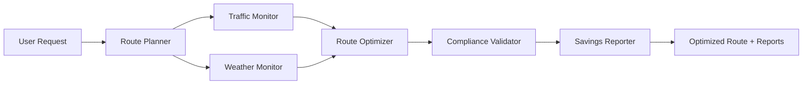

# Agent Workflow

## Introduction

The Smart Route Optimizer employs six specialized autonomous agents that work together in a pipeline to process route optimization requests. Each agent encapsulates a specific domain of logic and communicates via well-defined input/output contracts.

## Agent Communication Flow



## Agent Specifications

### 1. Route Planner Agent

**File:** `src/agents/route_planner.py`  
**Role:** Input validation and geocoding

**Input Contract:**
```python
{
    "start_address": str,
    "end_address": str,
    "vehicle_type": str,
    "delivery_window": Optional[datetime]
}
```

**Output Contract:**
```python
{
    "start": {"address": str, "lat": float, "lng": float},
    "end": {"address": str, "lat": float, "lng": float},
    "vehicle_type": str,
    "delivery_window": Optional[str]  # ISO format
}
```

**Dependencies:** None (first agent in pipeline)  
**External Calls:** None (uses in-memory geocoding mock)  
**Error Handling:** Raises `ValueError` for invalid addresses or vehicle types

**Business Logic:**
- Accepts only predefined Australian locations (currently NSW, VIC, QLD)
- Validates vehicle type against supported list
- Converts delivery window to ISO string if provided

---

### 2. Traffic Monitor Agent

**File:** `src/agents/traffic_monitor.py`  
**Role:** Real-time traffic incident retrieval

**Input Contract:**
```python
{"region": str}  # e.g., "NSW"
```

**Output Contract:**
```python
[
    {
        "type": str,          # "accident", "roadworks", "congestion"
        "location": {"lat": float, "lng": float},
        "road": str,
        "direction": str,
        "severity": str,      # "low", "medium", "high", "extreme"
        "delay_minutes": int,
        "description": Optional[str]
    }
]
```

**Dependencies:** None  
**External Calls:** Would call Live Traffic NSW API in production  
**Mock Data:** Predefined incidents stored in `TRAFFIC_INCIDENTS_NSW`

**Business Logic:**
- Returns all mock incidents for NSW region
- Simulates dynamic incident injection (30% chance) to showcase real-time behavior

---

### 3. Weather Monitor Agent

**File:** `src/agents/weather_monitor.py`  
**Role:** Weather alert retrieval and impact assessment

**Input Contract:**
```python
{"lat": float, "lng": float, "radius_km": int}
```

**Output Contract:**
```python
[
    {
        "type": str,          # "bushfire", "storm", "flood", "heatwave", "wind"
        "severity": str,
        "message": str,
        "location": {"lat": float, "lng": float}
    }
]
```

**Dependencies:** None  
**External Calls:** Would call Bureau of Meteorology (BOM) API in production  
**Mock Data:** Region-based alerts based on latitude zones

**Business Logic:**
- Northern NSW (lat < -33.0): bushfires, storms
- Central NSW (-33.0 ≤ lat ≤ -32.0): storms, floods
- Southern NSW (lat > -32.0): heatwaves, wind
- Applies severity multipliers: low=1.1x, medium=1.25x, high=1.5x, extreme=2.0x travel time

---

### 4. Route Optimizer Agent

**File:** `src/agents/route_optimizer.py`  
**Role:** Shortest-path computation with traffic/weather adjustments

**Input Contract:**
```python
{
    "start": {"lat": float, "lng": float},
    "end": {"lat": float, "lng": float},
    "vehicle_type": str
}
# Plus lists: traffic_incidents, weather_alerts
```

**Output Contract:**
```python
{
    "route": [  # List of waypoints
        {"lat": float, "lng": float, "name": str}
    ],
    "node_ids": List[str],      # Internal graph node identifiers
    "distance_km": float,
    "duration_hours": float,
    "vehicle_type": str,
    "base_distance_km": float   # Before adjustments
}
```

**Dependencies:**
- Reads `src/data/nsw_road_network.json` at module load
- Uses `utils.geospatial` for distance calculations

**Algorithm:** Dijkstra's shortest path on undirected graph  
**Adjustments:**
- Traffic: adds distance equivalent of delay minutes
- Weather: multiplies effective distance by severity factor

**Business Logic:**
- Finds nearest road network nodes to start/end
- Computes base shortest path via Dijkstra
- Adds traffic delay penalty (converted to km at base speed)
- Adds weather penalty (percentage increase)
- Duration = adjusted distance / vehicle speed

---

### 5. Compliance Validator Agent

**File:** `src/agents/compliance_validator.py`  
**Role:** NHVR fatigue rule and CoR law validation

**Input Contract:**
```python
{
    "duration_hours": float,
    "vehicle_type": str
}
# Optional: driver_hours_week (accumulated weekly hours)
```

**Output Contract:**
```python
{
    "nhvr_compliant": bool,
    "cor_compliant": bool,
    "fatigue_management": {
        "duration_hours": float,
        "daily_limit": int,
        "weekly_limit": int,
        "min_rest_hours": int,
        "violations": List[str],
        "warnings": List[str],
        "notes": List[str]
    },
    "vehicle_type": str
}
```

**Dependencies:**
- Loads `vehicle_constraints.json` (fuel rates, NHVR rules per vehicle)
- Loads `nhvr_rules.json` (full regulatory text)

**Rules Checked:**
1. Daily work hours ≤ vehicle-specific limit (default 12h)
2. Weekly total ≤ 72h (if `driver_hours_week` provided)
3. Rest period recommendation if ≥11h worked or remaining < 2h

**Business Logic:**
- Any violation → `nhvr_compliant = False`, `cor_compliant = False`
- CoR simplified: assumes CoR breach if NHVR violated
- Adds "Compliance: OK" note for fully compliant routes

---

### 6. Savings Reporter Agent

**File:** `src/agents/savings_reporter.py`  
**Role:** Fuel/CO₂ savings calculation and report generation

**Input Contract:**
```python
{
    "route": Dict,          # Optimized route (distance_km)
    "baseline_route": Dict, # Manual route (typically 15% longer)
    "vehicle_type": str
}
```

**Output Contract:**
```python
{
    "fuel_savings": {
        "litres": float,
        "cost_AUD": float,
        "co2_kg": float
    },
    "route_fuel_litres": float,
    "route_co2_kg": float,
    "baseline_fuel_litres": float,
    "baseline_co2_kg": float,
    "report_path": Optional[str]  # PDF path if generated
}
```

**Dependencies:**
- Uses `vehicle_constraints.json` for fuel consumption rates
- Constants: `FUEL_PRICE_AUD_PER_LITRE = 1.60`, `CO2_PER_LITRE = 0.4 kg`

**Outputs Produced:**
- **PDF Report** (`reportlab`): Summary table, cost savings, route details
- **GPX File** (custom XML): Waypoints and track for GPS import

**Business Logic:**
- Fuel = distance (km) × vehicle's `fuel_consumption_L_per_km`
- CO₂ = fuel × 0.4 kg/L
- Savings = baseline − optimized
- Baseline = optimized × 1.15 (15% longer typical of manual planning)

---

## Interaction Patterns

### Sequential Pipeline

The default workflow is strictly sequential:

```
User → API → (RoutePlanner → [TrafficMonitor, WeatherMonitor] → RouteOptimizer → ComplianceValidator → SavingsReporter) → Response
```

Each agent's output feeds the next agent's input. The API orchestrates the flow.

### Error Propagation

- Agents return dictionaries; errors are indicated via `{"error": "message"}` key
- API checks for `"error"` and raises `HTTPException` with 400 status
- Unexpected exceptions caught by global handler → 500 response

### Logging Strategy

All agents use Python's `logging` module with namespaced loggers:

```python
logger = logging.getLogger(__name__)
```

Log levels:
- `INFO`: Successful steps, route optimized, compliance status
- `WARNING`: Validation errors, non-compliant routes
- `ERROR`: Failures, exceptions, API downtime

---

## Extension Points

### Adding a New Agent

1. Create `src/agents/new_agent.py` with a single `run(input) -> output` function
2. Import into `src/app/main.py`
3. Insert into pipeline at appropriate stage
4. Update response model in `src/app/models.py` if needed

### Integrating Real APIs

Replace mock functions in traffic/weather monitors with actual HTTP calls:

```python
import requests

def fetch_traffic_incidents(region: str) -> List[Dict]:
    api_key = Config.LIVE_TRAFFIC_NSW_API_KEY
    url = f"https://api.traffic.nsw.gov.au/incidents?region={region}"
    response = requests.get(url, headers={"Authorization": api_key})
    response.raise_for_status()
    return response.json()["incidents"]
```

### Scaling to Multi-Vehicle VRP

Replace `route_optimizer.py`'s Dijkstra with OR-Tools Vehicle Routing Problem solver to handle:
- Multiple vehicles with capacity constraints
- Time windows for deliveries
- Driver shifts and relief points

---

## Agent Testing Strategy

Each agent has an isolated unit test file in `tests/`:
- `test_route_planner.py`: Input validation, geocoding
- `test_traffic_monitor.py`: Incident fetching, proximity detection
- `test_weather_monitor.py`: Alert retrieval, severity multipliers
- `test_route_optimizer.py`: Dijkstra correctness, adjustments
- `test_compliance_validator.py`: Rule enforcement edge cases
- `test_savings_reporter.py`: Fuel math, PDF/GPX generation

Integration tests in `test_api.py` verify end-to-end request handling.
