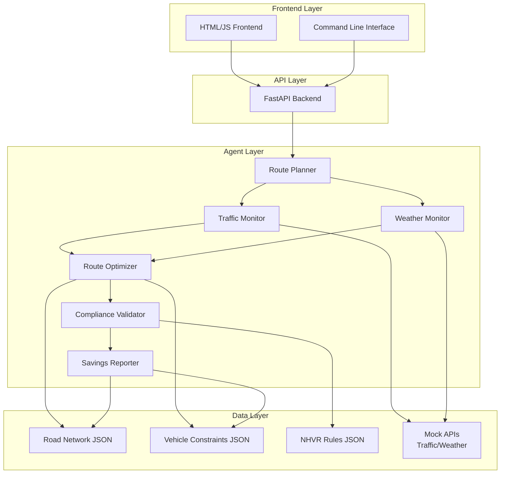
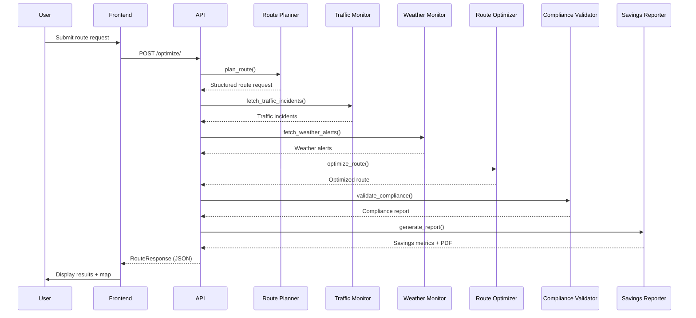

# System Architecture

## Overview

The Smart Route Optimizer is built using a multi-agent architecture where six autonomous agents collaborate to optimize routes while ensuring regulatory compliance. The system is designed with separation of concerns, modularity, and scalability in mind.

## High-Level Architecture



## Component Details

### Frontend Layer

| Component | Technology | Purpose |
|-----------|-----------|---------|
| HTML/JS Interface | Vanilla JavaScript + Leaflet.js | Interactive map visualization, route input form, results display |
| CLI | Python + argparse | Command-line route optimization for integration and testing |
| Static Assets | CSS | Responsive styling for professional UI |

### API Layer

| Component | Technology | Purpose |
|-----------|-----------|---------|
| Web Framework | FastAPI 0.104.1 | RESTful API endpoints, automatic OpenAPI docs |
| Server | Uvicorn 0.24.0 | ASGI server for production |
| Validation | Pydantic v2 | Request/response validation with type safety |
| CORS | CORSMiddleware | Cross-origin support for frontend |

### Agent Layer

The six agents operate asynchronously within a single process for the demo, but are architecturally independent.

#### 1. Route Planner (`route_planner.py`)

**Responsibilities:**
- Validate user input (addresses, vehicle type, delivery window)
- Geocode addresses to coordinates (mock database for demo)
- Produce a structured `RouteRequest` object

**Inputs:** `start_address`, `end_address`, `vehicle_type`, `delivery_window`  
**Outputs:** Structured dict with coordinates and constraints

**Key Functions:**
```python
def plan_route(start_address: str, end_address: str, vehicle_type: str,
               delivery_window: Optional[datetime] = None) -> Dict
```

#### 2. Traffic Monitor (`traffic_monitor.py`)

**Responsibilities:**
- Fetch real-time traffic incident data (mock for demo)
- Identify incidents that may affect the route
- Provide delay estimates

**Inputs:** `region` (e.g., "NSW")  
**Outputs:** List of traffic incidents with `type`, `location`, `severity`, `delay_minutes`

**Key Functions:**
```python
def fetch_traffic_incidents(region: str = "NSW") -> List[Dict]
def is_route_affected_by_incident(route_coords, incident, buffer_km=5.0) -> bool
```

#### 3. Weather Monitor (`weather_monitor.py`)

**Responsibilities:**
- Check weather alerts along the route
- Provide severity multipliers for speed adjustments

**Inputs:** `lat`, `lng`, `radius_km`  
**Outputs:** Weather alerts with `type`, `severity`, `message`

**Key Functions:**
```python
def fetch_weather_alerts(lat: float, lng: float, radius_km: int = 50) -> List[Dict]
def get_weather_impact_multiplier(severity: str) -> float
```

#### 4. Route Optimizer (`route_optimizer.py`)

**Responsibilities:**
- Load road network graph
- Run shortest-path algorithm (Dijkstra's)
- Apply traffic and weather adjustments to travel time/distance
- Return optimized waypoints and metrics

**Algorithm:** Dijkstra's (simplified for demo; production would use OR-Tools VRP)  
**Graph Data:** Undirected weighted graph from `nsw_road_network.json`

**Key Functions:**
```python
def optimize_route(route_request: Dict, traffic_incidents: List, weather_alerts: List) -> Dict
def _dijkstra(start: str, end: str) -> Tuple[List[str], float]
```

#### 5. Compliance Validator (`compliance_validator.py`)

**Responsibilities:**
- Validate route duration against NHVR fatigue rules
- Check Chain of Responsibility (CoR) adherence
- Provide detailed compliance breakdown

**Rules Checked:**
- Daily work hours ≤ 12
- Weekly work hours ≤ 72 (if driver history provided)
- Minimum rest period recommendations

**Key Functions:**
```python
def validate_compliance(route: Dict, vehicle_type: str, driver_hours_week: float = 0.0) -> Dict
```

#### 6. Savings Reporter (`savings_reporter.py`)

**Responsibilities:**
- Calculate fuel savings using vehicle-specific consumption rates
- Compute CO₂ emissions reduction
- Generate PDF reports (ReportLab)
- Generate GPX files for GPS navigation

**Key Functions:**
```python
def generate_report(route: Dict, baseline_route: Dict, vehicle_type: str,
                    output_path: Optional[str] = None) -> Dict
def generate_gpx_route(route: Dict, output_path: str) -> str
```

### Data Layer

All data is stored as JSON files for easy editing and demonstration.

| File | Purpose |
|------|---------|
| `src/data/nsw_road_network.json` | Nodes (locations) and edges (roads with distances/speeds) |
| `src/data/vehicle_constraints.json` | Max speed, fuel rates, dimensions, NHVR rules per vehicle |
| `src/data/nhvr_rules.json` | Detailed fatigue management and CoR requirements |

## Data Flow



## Security Architecture

### Input Validation
- Coordinates validated via Pydantic (`-90 ≤ lat ≤ 90`, `-180 ≤ lng ≤ 180`)
- Vehicle type checked against allow-list (`Truck`, `B-Double`, `Semi-Trailer`)
- Addresses restricted to predefined mock database (no arbitrary input)

### Path Traversal Protection
- Report file serving uses `pathlib.Path` with resolved paths
- Filenames are checked to ensure they reside within the `reports/` directory
- No direct user-controlled path construction

### Secrets Management
- All API keys stored in `.env` (gitignored)
- Demo uses mock keys; real deployment would use environment variables

### CORS
- Configured permissively for demo (`allow_origins=["*"]`)
- Production deployment should restrict to specific domains

### Error Handling
- Global exception handlers prevent stack trace leakage
- HTTP errors return structured JSON with `error` and `status_code`
- Internal errors logged with full traceback for debugging

## Performance Considerations

- **Distance Matrix**: Pre-computed adjacency list for O(1) neighbor lookups
- **Shortest Path**: Dijkstra's algorithm with binary heap (O(E log V))
- **Caching**: Not implemented in demo (future: Redis for traffic/weather)
- **Report Generation**: Async file I/O to avoid blocking API responses

## Scalability Pathways

For production scaling, consider:
- OR-Tools VRP for multi-vehicle, multi-stop optimization
- Real-time traffic APIs with rate limiting and caching
- Message queue (Celery/RabbitMQ) for async report generation
- Database (PostgreSQL + PostGIS) for spatial queries
- Load balancer (NGINX) with multiple API workers
- Container orchestration (Kubernetes) for high availability

## Technology Choices Rationale

| Choice | Reasoning |
|--------|------------|
| **FastAPI** | Automatic docs, async support, high performance |
| **Pydantic** | Runtime validation, JSON Schema generation |
| **Leaflet.js** | Lightweight, open-source maps, extensive plugin ecosystem |
| **Dijkstra** | Simple, deterministic, fits demo scale |
| **ReportLab** | Mature PDF generation, fine-grained layout control |
| **Pytest** | Feature-rich, parametrizable, good ecosystem |
